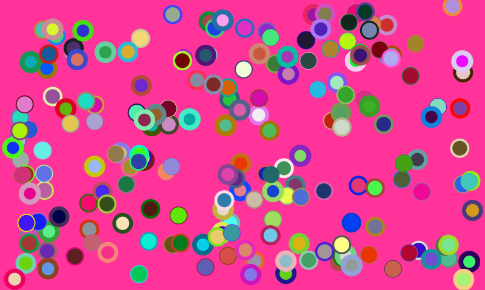

# Ball Moves Towards Mouse With Colors

A quick implementation of ball moving towards mouse

# Key features

1. Assign random colors to each of the ellipses
1. Assign random stroke colors to each of the ellipses
1. Assign random stroke weight to each of the ellipses
1. Break Point that reassigns all random values

# References

1. https://natureofcode.com/book/chapter-1-vectors/
1. https://github.com/nature-of-code/noc-examples-p5.js/tree/master/chp01_vectors/NOC_1_11_motion101_acceleration_array

# Art Portfolio

1. Check out my [Behance Page](https://www.behance.net/vijayasimhabr)
1. Check out my [Unsplash Page](https://unsplash.com/@jay_neeruhaaku)

# Hire Me

I work as a full time freelance software developer and coding tutor. Hire me at [UpWork](https://www.upwork.com/fl/vijayasimhabr) or [Fiverr](https://www.fiverr.com/jay_codeguy). 

# important note 

This code is provided as is without any warranties. It's primarily meant for my own personal use, and to make it easy for me share code with my students. Feel free to use this code as it pleases you.

I can be reached through my website - [Jay's Developer Profile](https://jay-study-nildana.github.io/developerprofile)