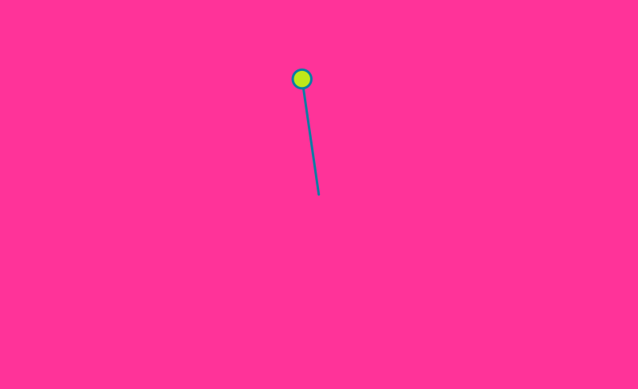

# Pendulum 360

A quick implementation of Pendulum 360 with some of my own modifications. 




# Notes

1. let spiralDraw = true; can help you generate a nice spiral.
1. Also, the following can help with x and y axis oscillation

```

  //oscilation across y axis
  // let x = 0;
  // let y = r * sin(theta);    

  //oscilation across x axis
  // let x = r * cos(theta);
  // let y = 0; 

```

# References

1. https://natureofcode.com/book/chapter-3-oscillation/
https://github.com/nature-of-code/noc-examples-p5.js/tree/master/chp03_oscillation/NOC_3_04_PolarToCartesian

# Art Portfolio

1. Check out my [Behance Page](https://www.behance.net/vijayasimhabr)
1. Check out my [Unsplash Page](https://unsplash.com/@jay_neeruhaaku)

# Hire Me

I work as a full time freelance software developer and coding tutor. Hire me at [UpWork](https://www.upwork.com/fl/vijayasimhabr) or [Fiverr](https://www.fiverr.com/jay_codeguy). 

# important note 

This code is provided as is without any warranties. It's primarily meant for my own personal use, and to make it easy for me share code with my students. Feel free to use this code as it pleases you.

I can be reached through my website - [Jay's Developer Profile](https://jay-study-nildana.github.io/developerprofile)