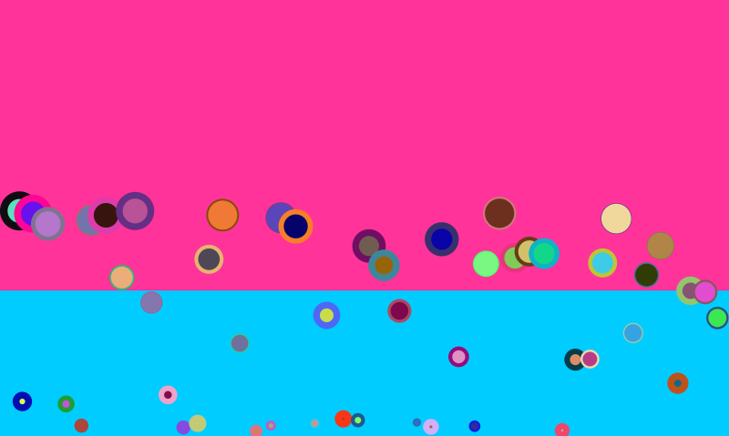

# Balls of Many Masses With Water

A quick implementation of Objects with different masses. As aways, some of my own remixes.

This includes the water drag stuff.

# Known Issues

1. For some reason, the objects keep sliding to the bottom right corner. I think it is the wind force. TODO.

# Key settings

1. let realGravity = true; Turning this on and off will give you different styles of gravity. 
1. On would mean, you get gravity just like in real life. All objects irrespective of their mass, will have the same gravity and fall at the same speed. 
1. Off would mean, we get a more, mass based gravity. Each object falls and bounces at its own speed. It looks cool, but is not realistic.
1. gravityY - sets the actual gravity. Increase to make it faster. reduce to make it slower.

# References

1. https://natureofcode.com/book/chapter-2-forces/
1. https://github.com/nature-of-code/noc-examples-p5.js/tree/master/chp02_forces/NOC_2_01_forces
1. https://github.com/nature-of-code/noc-examples-p5.js/tree/master/chp02_forces/NOC_2_03_forces
1. https://github.com/nature-of-code/noc-examples-p5.js/tree/master/chp02_forces/NOC_2_02_forces

# Art Portfolio

1. Check out my [Behance Page](https://www.behance.net/vijayasimhabr)
1. Check out my [Unsplash Page](https://unsplash.com/@jay_neeruhaaku)

# Hire Me

I work as a full time freelance software developer and coding tutor. Hire me at [UpWork](https://www.upwork.com/fl/vijayasimhabr) or [Fiverr](https://www.fiverr.com/jay_codeguy). 

# important note 

This code is provided as is without any warranties. It's primarily meant for my own personal use, and to make it easy for me share code with my students. Feel free to use this code as it pleases you.

I can be reached through my website - [Jay's Developer Profile](https://jay-study-nildana.github.io/developerprofile)