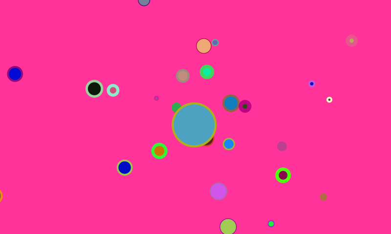

# Earth and Moon

A quick implementation of attraction. Resembles moon around earth. Kind of. we dont get a perfect circular movement though.

I decided to use an array for the moon thing so we have dozens of celestial objects trying to circle the center figure.

# References

1. https://natureofcode.com/book/chapter-2-forces/
1. https://github.com/nature-of-code/noc-examples-p5.js/tree/master/chp02_forces/NOC_2_06_attraction

# Art Portfolio

1. Check out my [Behance Page](https://www.behance.net/vijayasimhabr)
1. Check out my [Unsplash Page](https://unsplash.com/@jay_neeruhaaku)

# Hire Me

I work as a full time freelance software developer and coding tutor. Hire me at [UpWork](https://www.upwork.com/fl/vijayasimhabr) or [Fiverr](https://www.fiverr.com/jay_codeguy). 

# important note 

This code is provided as is without any warranties. It's primarily meant for my own personal use, and to make it easy for me share code with my students. Feel free to use this code as it pleases you.

I can be reached through my website - [Jay's Developer Profile](https://jay-study-nildana.github.io/developerprofile)