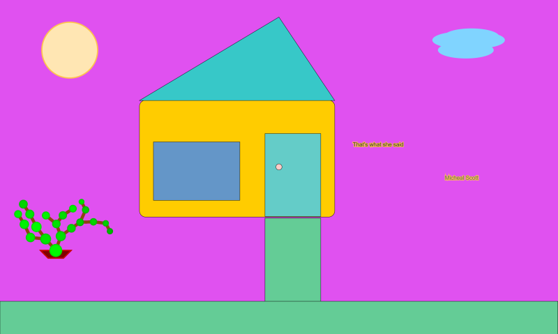

# p5 JS Simple House

This is a P5 JS project that attempts to draw a house.

Look at [ReferenceHandDrawing.jpg](ReferenceHandDrawing.jpg).

When the code is done, it should look something like that drawing. 

As of now, the visuals are 'extremely' rough, boring and dull. However, I plan to dig deep into P5.JS as part of my Random Stuff Project. So, it will get better for sure.

# TODO - Version History

Update it in the docs.

# Coding Stages

I took screenshots as the code was being built. Find them here - [CodeImageStages](CodeImageStages)

Note : The project has 'click' to download screenshot option enabled.

# Note About 'NoLoop()

This project is focused on drawing, rather than animation. 

I may eventually add code related to animation but as of now, my focus is strictly on drawing and using P5 JS as a 2D canvas.

# How To Run

1. This is a basic HTML + CSS + JS project. check - https://github.com/Jay-study-nildana/BootstrapForStudents - for more details.
1. Default on 'Live Server' Extension is - http://127.0.0.1:5500/

# References

1. Bootstrap Template - https://github.com/Jay-study-nildana/BootstrapForStudents
1. P5.JS - https://p5js.org
1. Basic Fetch - https://developer.mozilla.org/en-US/docs/Web/API/Fetch_API/Using_Fetch
1. Random Stuff API Server - https://jay-study-nildana.github.io/RandomStuffDocs/APIServer/
1. https://happycoding.io/examples/p5js/ - Borrowed some code from here

# Hire Me

I work as a full time freelance software developer and coding tutor. Hire me at [UpWork](https://www.upwork.com/fl/vijayasimhabr) or [Fiverr](https://www.fiverr.com/jay_codeguy). 

# important note 

This code is provided as is without any warranties. It's primarily meant for my own personal use, and to make it easy for me share code with my students. Feel free to use this code as it pleases you.

I can be reached through my website - [Jay's Developer Profile](https://jay-study-nildana.github.io/developerprofile)