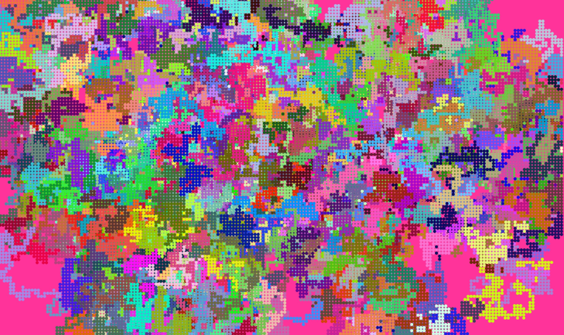

# P5 JS For Students

P5.js is a simple JavaScript library that anybody can use. Here, I put some of my learnings for students to explore.

A massive thanks to [The Nature of Code](https://natureofcode.com).

*Note: Image generated from code in ChapterZero > IntroductionRandomWalks. This is one of my favorites because it just looks so cool.*

## Online Editors for P5.js

1. [P5.js Web Editor](https://editor.p5js.org/)
1. [OpenProcessing](https://openprocessing.org)

## Project Folders

1. [StarterProjects](StarterProjects) - Use one of the folders here to get yourself started.
1. [Zero](ChapterZero) - Perlin Noise, Random Walks, and Random Number Distribution.
1. [Vectors](ChapterOneVectors) - Bouncing Ball, Ball Moving Towards Mouse.
1. [Forces](ChapterTwoForces) - Balls of Different Masses, and Balls Inside Water.
1. [Oscillation](ChapterThreeOscillation) - Pendulum-like a clock thing, Angular Motion, Cannon Ball, Cars moving towards mouse, and Waves.
1. [ParticleSystems](ChapterFourParticleSystems) - Particles Flowing Out On Click.
1. [Fractals](ChapterEightFractals) - Fractal Trees.
1. [OtherStuff](OtherProjects) - Simple House with colors.
1. [Archives](Archives) - Archived projects.

## Additional Notes

- Also read [DeveloperTips.md](DeveloperTips.md)
- Also read [DeveloperThoughts.md](DeveloperThoughts.md)
- Also read [References.md](References.md)

## Book a Session with Me

1. [Calendly](https://calendly.com/jaycodingtutor/30min)

## Hire and Get to Know Me

Find ways to hire me, follow me, and stay in touch with me.

1. [GitHub](https://github.com/Jay-study-nildana)
1. [Personal Site](https://thechalakas.com)
1. [Upwork](https://www.upwork.com/fl/vijayasimhabr)
1. [Fiverr](https://www.fiverr.com/jay_codeguy)
1. [Codementor](https://www.codementor.io/@vijayasimhabr)
1. [Stack Overflow](https://stackoverflow.com/users/5338888/jay)
1. [Jay's Coding Channel on YouTube](https://www.youtube.com/channel/UCJJVulg4J7POMdX0veuacXw/)
1. [Medium Blog](https://medium.com/@vijayasimhabr)