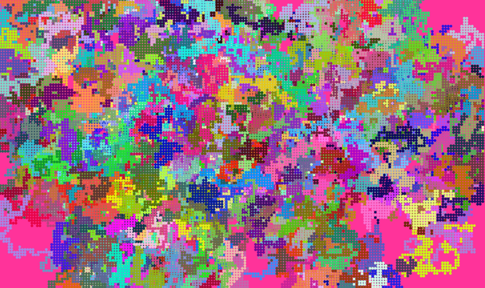

# P5 JS For Students

P5 JS is one of those simple JS libraries that anybody can use. Here, I put some of my learnings for students to explore.

Note : Image generated from code in ChapterZero > IntroductionRandomWalks. This is one of my favorites, because, it just looks so cool.

Note : Each folder contains an example output image. This should help you get to the exact code that you are looking for, based on the appearance.

Note : I am, ultimately, just a simple tutor who has some decent tutoring skills. Most of the code you see here is borrowed from open source, free code written by someone, somewhere, from all over the internet. I have ensured that the original author is credited in every project here.

- Also read [DeveloperTips.md](DeveloperTips.md)
- Also read [DeveloperThoughts.md](DeveloperThoughts.md)
- Also read [References.md](References.md)

# Live Editor

1. https://editor.p5js.org/

I am not a big fan of this. I would recommend you use it when you really, really, dont have another option. Or, when you want to show stuff to your colleagues in a easy, sharable link. I personally prefer a combination of github and screenshots/video links to showcase my P5.JS work.

# Project Folders

1. [StarterProjects](StarterProjects) - use one of the folders here to get yourself started.
1. [Zero](ChapterZero) - Perlin Noise, Random Walks and Rand Number Distribution.
1. [Vectors](ChapterOneVectors) - Bouncing Ball, Ball Moving Towards Mouse.
1. [Forces](ChapterTwoForces) - Balls of Different Masses, and Balls Inside Water.
1. [Oscillation](ChapterThreeOscillation) - Pendulum like a clock thing, Angular Motion, Cannon Ball, Cars moving towards mouse and Waves.
1. [ParticleSystems](ChapterFourParticleSystems) - Particles Flowing Out On Click.
1. [Fractals](ChapterEightFractals) - Fractal Trees.
1. [OtherStuff](OtherProjects) - Simple House with colors.

# Hire Me

I work as a full time freelance software developer and coding tutor. Hire me at [UpWork](https://www.upwork.com/fl/vijayasimhabr) or [Fiverr](https://www.fiverr.com/jay_codeguy).

# Hobbies

I try to maintain a few hobbies.

1. Podcasting. You can listen to my [podcast here](https://stories.thechalakas.com/listen-to-podcast/).
1. Photography. You can see my photography on [Unsplash here](https://unsplash.com/@jay_neeruhaaku).
1. Digital Photorealism 3D Art and Arch Viz. You can see my work on this on [Adobe Behance](https://www.behance.net/vijayasimhabr).
1. Writing and Blogging. You can read my blogs. I have many medium Publications. [Read them here](https://medium.com/@vijayasimhabr).

# important note

This code is provided as is without any warranties. It's primarily meant for my own personal use, and to make it easy for me share code with my students. Feel free to use this code as it pleases you.

I can be reached through my website - [Jay's Developer Profile](https://jay-study-nildana.github.io/developerprofile)
